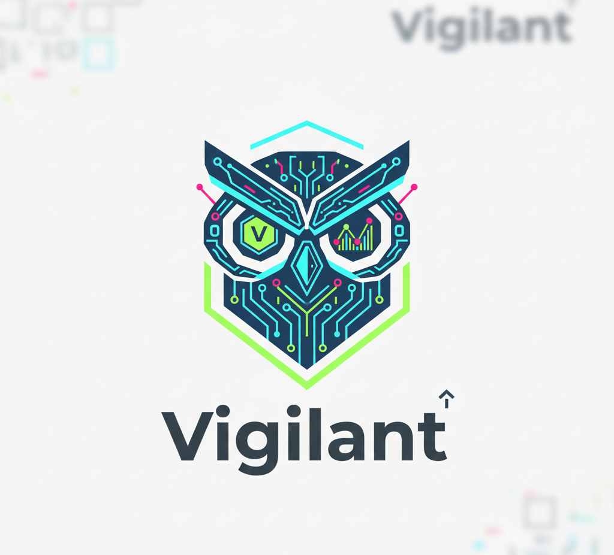

## Vigilant – Local-First Cloud Command Center (Lab)




Vigilant is a **local-first Cloud Command Center lab** that runs entirely on your machine using **Docker + LocalStack**.  
It detects:

- **Infrastructure Drift** – resources that exist in “AWS” (LocalStack) but are not managed by Terraform.
- **Cost Bleed** – estimated monthly cost of unmanaged resources.
- **Traffic Risk** – suspicious traffic hitting unmanaged infrastructure.

This repo is structured as a hands-on lab to simulate AWS using LocalStack, with Terraform, a Python backend, and a React frontend.  
You can iterate safely against LocalStack first, and later adapt the same Terraform and application code to deploy to a real cloud provider (for example, AWS) once you are ready.

### 🛡️ The Challenge: Shadow IT & Cost Bleed

Modern teams move fast. Often, developers make manual "quick fixes" in the AWS Console that never make it back into Terraform.  
These changes create **Security Drift** and **Cost Bleed** that remain invisible until the end-of-month bill.  
**Vigilant** brings these hidden resources into the light.

---

### Architecture Overview

- **Phase 1 – Lab (Infrastructure & Mocking)**
  - `docker-compose.yml` – LocalStack, PostgreSQL, Redis.
  - `terraform/` – Terraform (used via `tflocal`) for:
    - 1x S3 bucket (managed)
    - 1x EC2 instance (`t3.medium`)
    - 1x Security Group (port 80 allowed)
  - `setup_lab.sh` – applies Terraform with `tflocal` and uses `awslocal` to create an extra unmanaged S3 bucket to simulate drift.

- **Phase 2 – Analyzer (Backend, Python/FastAPI)** _(to be implemented)_
  - `TerraformService` to parse `terraform.tfstate` and extract managed resource IDs.
  - `inventory.py` to discover live resources in LocalStack (Boto3 with `endpoint_url="http://localhost:4566"`).
  - `pricing_engine.py` using `mock_prices.json` to estimate **Cost Bleed** of unmanaged resources.
  - FastAPI app exposing `/api/v1/drift-summary` with Pydantic response models.

- **Phase 3 – Observer (Traffic Intelligence)** _(to be implemented)_
  - `traffic_gen.py` to generate fake Nginx logs with mixed IP geographies.
  - Log parser that uses `geoip2` + local DB to flag risky traffic hitting unmanaged IPs.

- **Phase 4 – Command Center (Frontend, React)** _(to be implemented)_
  - Vite + React + Tailwind app in `frontend/`.
  - Cyber-security dark theme:
    - **Rose-500** → drift / danger.
    - **Emerald-500** → synced / healthy.
  - “VPC Dashboard” with:
    - Red Alert card: total monthly Cost Bleed.
    - Sync status: % of resources managed by Terraform vs manual.
    - Live traffic table of IPs hitting unmanaged infrastructure.

---

### Prerequisites

| Tool | Purpose | Install |
| --- | --- | --- |
| **Docker** | Core infrastructure runtime | [Get Docker](https://docs.docker.com/get-docker/) |
| **Docker Compose** | Multi-service orchestration | Included with Docker Desktop or `docker compose` plugin |
| **LocalStack** | AWS simulation | `pip install localstack` |
| **tflocal** | Terraform wrapper for LocalStack | `pip install terraform-local` |
| **Terraform CLI** | Infrastructure as code engine | [Install Terraform](https://developer.hashicorp.com/terraform/install) |
| **Git** | Version control | [Install Git](https://git-scm.com/downloads) |
| **Python 3.11+** | Backend runtime (later phases) | [Install Python](https://www.python.org/downloads/) |
| **Node.js** | Frontend build/runtime (later phases) | [Install Node.js](https://nodejs.org/en/download) |

On Windows, you can run everything from **WSL** or Git Bash for best compatibility, or adapt the shell scripts to PowerShell equivalents.

---

### Getting Started (Local Lab)

1. **Clone the repository (recommended GitHub repo name: `Vigilant`)**

```bash
git clone https://github.com/<your-username>/Vigilant.git
cd Vigilant
```

2. **Start the local lab services**

```bash
docker-compose up -d
```

This starts:

- LocalStack on `http://localhost:4566`
- PostgreSQL on port `5432`
- Redis on port `6379`

3. **Initialize the Terraform lab (via LocalStack)**

```bash
bash setup_lab.sh
```

What this does:

- Runs `tflocal init` and `tflocal apply` in `terraform/`.
- Provisions:
  - 1x S3 Bucket (managed).
  - 1x EC2 Instance (`t3.medium`).
  - 1x Security Group (HTTP/80 allowed from anywhere).
- Uses `awslocal` to create a **second, unmanaged S3 bucket** (`vigilant-unmanaged-bucket`) to simulate drift.

---

### LocalStack & Tooling Conventions

- **Terraform** must be run via **`tflocal`**, not `terraform` directly.
- **AWS SDK (Boto3)** must always point to LocalStack:

```python
import boto3

s3 = boto3.client("s3", endpoint_url="http://localhost:4566")
```

- **AWS CLI** should be accessed through `awslocal` when talking to LocalStack.

---

### Git & GitHub Usage

1. **Initialize Git (if not already)**

```bash
git init
git add .
git commit -m "Initial Vigilant lab: LocalStack, Terraform, setup script"
```

2. **Create a GitHub repository**

- Create a new repo named **`Vigilant`** in your GitHub account.
- Then connect and push:

```bash
git remote add origin https://github.com/<your-username>/Vigilant.git
git branch -M main
git push -u origin main
```

---

### Renaming the Local Folder to `Vigilant`

Your current folder is `latestprojectfull`. To align with the project name:

1. Close any editors/terminals pointing to the folder.
2. In **File Explorer**, rename:
   - `C:\Users\Shefqet\Desktop\latestprojectfull` → `C:\Users\Shefqet\Desktop\Vigilant`
3. Re-open the project in your editor from the new path (`Vigilant`).

Git will continue to work as long as you operate from the new folder.

---

### How it looks in action

> 📊 Sample API Output (`/api/v1/drift-summary`)

```json
{
  "summary": {
    "status": "DRIFT_DETECTED",
    "unmanaged_resources": 2,
    "monthly_bleed_est": "$45.20"
  },
  "drift_details": [
    {
      "resource": "aws_s3_bucket.vigilant-unmanaged",
      "reason": "Resource not found in terraform.tfstate",
      "hourly_cost": "$0.02"
    }
  ]
}
```

---

### Roadmap

- **Phase 2 – Analyzer (Backend)**
  - Parse `terraform.tfstate` → managed resource IDs.
  - Discover live resources via LocalStack (Boto3).
  - Compute unmanaged resources + Cost Bleed using local `mock_prices.json`.
  - Expose `/api/v1/drift-summary` via FastAPI (Pydantic models, strict type hints).

- **Phase 3 – Observer (Traffic Intelligence)**
  - Generate fake Nginx logs.
  - Parse logs, perform `geoip2` lookup from local DB.
  - Identify risky traffic targeting unmanaged IPs.

- **Phase 4 – Command Center (Frontend)**
  - Build Vite + React + Tailwind dashboard with cyber-security dark theme.
  - Show drift, cost bleed, and traffic risk in real time.

---

### Notes

- This project is intentionally **local-first**; it must **never** talk to real AWS accounts during lab use.
- All infrastructure interactions are through **LocalStack** for safe experimentation, with the option to adapt Terraform and app code later for a real cloud provider.

---

### License

This project is licensed under the **Apache License 2.0**.  
You are free to use, modify, and distribute this code under the terms of that license. A dedicated `LICENSE` file can be added for full legal text when publishing publicly.

